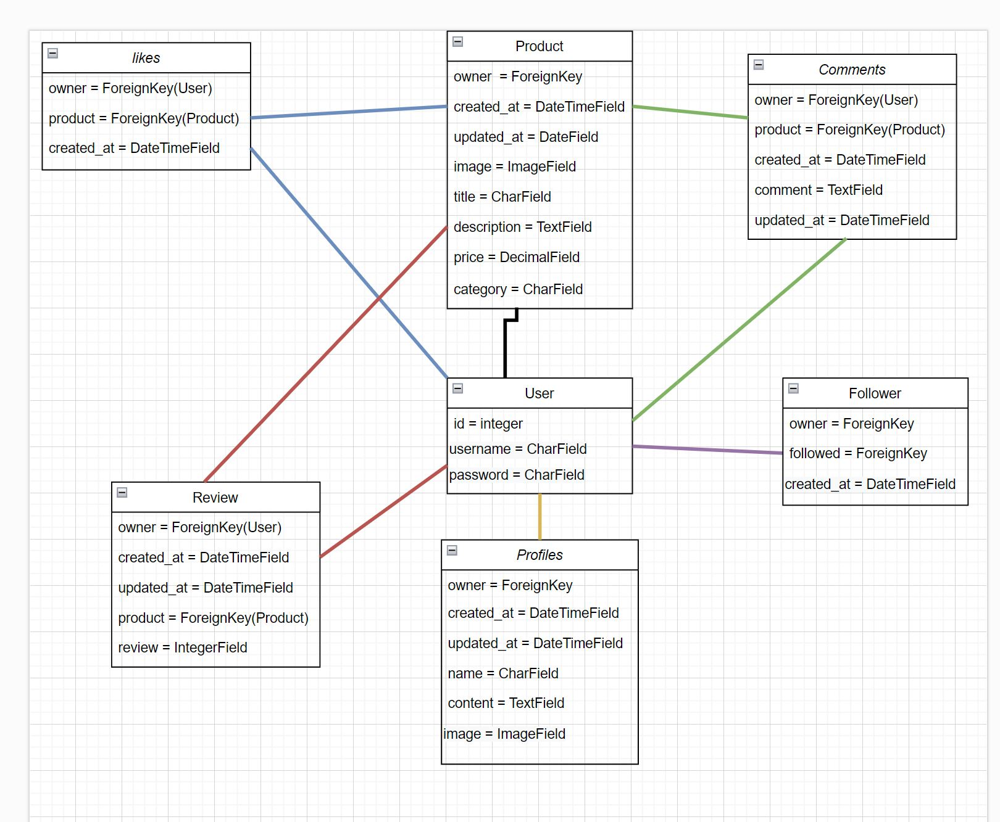
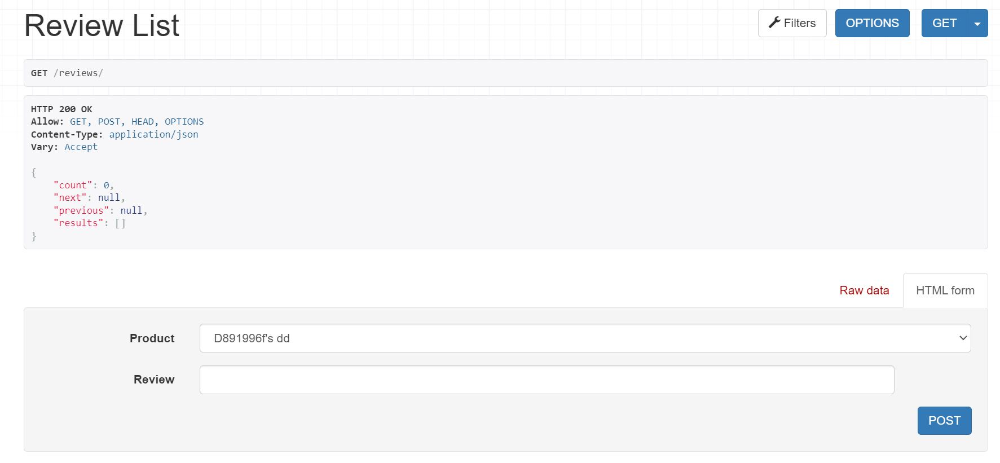
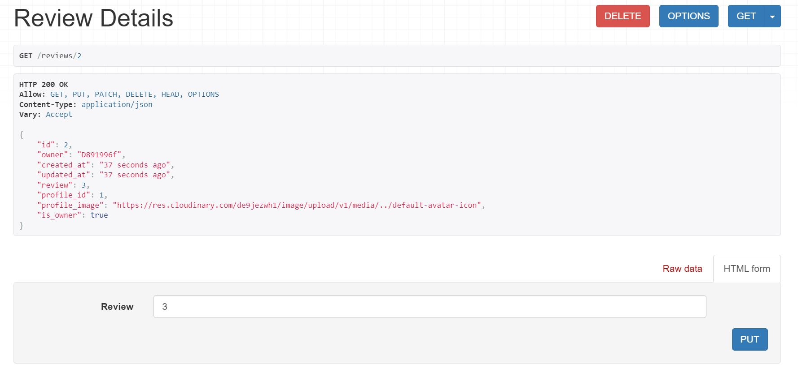

# MarketPlace Api 

This API is the backend part of my marketplace project where the user can upload photos, descriptions, and prices and categorize all the products that they want to sell.

The user is allowed to comment on the product posted to show his interest, leave a like and follow the seller so don't miss any new product.

This database is developed using REST Framework.

# Database Structure

## Testing 

### Manual Testing

* CRUD Testing

- An authenticated user can successfully update his profile, read the list of profiles, delete his profile, create a product insertion, read the list of products, update his insertion, delete his insertion

- An authenticated user can follow other profiles, unfollow the profiles, see the list of followers, and follow

- An authenticated user can comment on an insertion, delete his comment, update it

- An authenticated user can leave like to one insertion, unlike the insertion

* Examples

- User can see the profile, have a delete button, an update changing the value in the form

- User can create a product insertion

- User can see product details, delete and update own insertions

- User can see the follower list

- User can delete(unfollow) 

- User can see comments list

- Users can delete or update comments that their own

- User can see reviews list

- Users can delete or update reviews that their own

* Urls 

- Tested all the paths to make sure everything work as expected 

# Bugs

- At the moment I didn't occur any bug to be solved

# Errors

- Only errors that occurred are too long lines, kept the code like this for better readability

# Project Creation

- Start your repository using the Code Institute gitpod-full-template

- Install the needed libraries, Django, after that start your project using the code django-admin startproject /nameofyourrepository/

- After that install django-cloudinary-storage and PIllow to use the credentials of your Cloudinary account.

- Add the app previously installed in settings.py

- Create an env.py file to set up your environment variables

- First of all import os in your env.py file and add the CLOUDINARY_URL variable with the value of the URL of your account

- Write an if statement that checks if env.py exists and if exists import env

- After that update settings.py adding the CLOUDINARY_STORAGE variable with CLOUDINARY_URL as an object with the value of the environment variable

- After that to create a new application in the project use the code python manage.py startapp /nameoftheapp/

- Update the installed app in settings.py

- For this project then is necessary to install djangorestframework

# Deployment

- Install JSON Web Tokens using the code pip install dj-rest-auth

- Update the settings.py file with the app just installed

- Include the urls from dj-rest-auth in the pattern list the urls using path('dj-rest-auth/', include('dj_rest_auth.urls'))

- Migrate the terminal with python manage.py migrate

- To allow the user to register install dj-rest-auth[with_social]

- Update the installed app with the required app just installed

- Add in settings.py the variable SITE_ID = 1 

- As for the dj-rest-auth include the urls using path(
        'dj-rest-auth/registration/', include('dj_rest_auth.registration.urls')
    ),

- Install the JSON tokens by installing djangorestframework-simplejwt

- Before the deployment is required to define a DEV variable in env.py so in the settings.py is possible to define if we are working in development or production

- The code used to define production or development is 

REST_FRAMEWORK = {
    'DEFAULT_AUTHENTICATION_CLASSES': [(
        'rest_framework.authentication.SessionAuthentication'
        if 'DEV' in os.environ
        else 'dj_rest_auth.jwt_auth.JWTCookieAuthentication'
    )],

- Add the code that enables token authentication 

- Create a serializer in the project folder to add the code for the current user 

- Replace the default user serializer in settings.py

- Migrate the database

- install dj_database_url==0.5.0 and psycopg2

- import dj_database_url in settings.py

- Update the Database variable adding the if statement that checks for the presence of the Dev variable to determine if we are in production or development

- Add in env.py the variable DATABASE_URL with the URL of the ElephantSQL database create previously 

- To migrate all the data in the new database you need to comment out the DEV variable and then migrate all the database

- Create a new superuser from the moment the old one is not present anymore

- install Gunicorn

- Update ones again the requirements.txt file 

- Create a Procfile and add in it the command release: python manage.py makemigrations && python manage.py migrate web: gunicorn /projectname/.wsgi 

- In settings.py replace the value of ALLOWED_HOST including the Heroku app URL 

- Add Corsheader in Middleware

- under the MiddleWare section add the code that checks for the allowed origins that can make a request to this API with the code  

    if 'CLIENT_ORIGIN' in os.environ:
     CORS_ALLOWED_ORIGINS = [
         os.environ.get('CLIENT_ORIGIN')
     ]
    else:
     CORS_ALLOWED_ORIGIN_REGEXES = [
         r"^https://.*\.gitpod\.io$",
     ]
    CORS_ALLOW_CREDENTIALS = True

- Add the variable JWT_AUTH_SAMESITE

- replace the variable SECRET_KEY with the one in the environmental file, if the secret key used is expose in the gitpod commit make sure to change it before deploying on Heroku

- Set Debug to False

- update requirements.txt

- add, commit, and push

- Once done that go on Heroku and deploy the repository adding all the variables needed like CLOUDINARY_URL, DATABASE_URL, SECRET_KEY, DISABLECOLLECTSTATIC, and ALLOWED_HOST

# CREDITS

- Big thanks to Code Institute for all the knowledge learned in this course and all the explanations step by step in this career change for me so important

